# Next Up: System Design Document

## Architecture Overview

This document describes the data pipeline, processing workflow, and application architecture for the Next Up G-League call-up prediction system.

```mermaid
flowchart LR

  %% =========================
  %% Data Sources
  %% =========================
  A1[SportsRadar API\nG-League player stats\nrosters + teams\nmulti-season 2019-2024]
  
  A2[HoopsRumors\n10-day contract tracker\nscraped 2007-2025]
  
  A3[Two-Way Contracts\nmanual collection\nconversion tracking]
  
  A4[Manual Call-up Labels\nNBA transactions\nRealGM / HoopsHype\nTARGET VARIABLE]

  %% =========================
  %% ETL + Data Collection
  %% =========================
  B0((Next Up ETL Pipeline))
  
  B1[collect_data.py\nSportsRadar API client\nrate limiting + caching\nraw_json/ cache]
  
  B2[callup_data.py\nHoopsRumors scraper\n10-day contract parser\ndate normalization]
  
  B3[Manual Collection\ncallups.csv template\nplayer matching\nlabeling 0/1]

  %% =========================
  %% Raw Storage
  %% =========================
  C1[(raw/\ngleague_player_season_stats\nYYYY_REG.csv)]
  
  C2[(raw/\ngleague_players.csv\ngleague_rosters.csv\ngleague_teams.csv)]
  
  C3[(data/\ncallups_10day_tidy.csv\ntwo_way_contracts.csv\ntwo_way_conversions.csv)]
  
  C4[(data/external/\ncallups.csv\nTARGET LABELS)]

  %% =========================
  %% Data Processing
  %% =========================
  D0[data.ipynb\nData Cleaning + Merging]
  
  D1[Name Normalization\ncomma-separated names\nunidecode standardization]
  
  D2[Data Merging\ncontracts + stats\nleft join on player_name]
  
  D3[combined_gleague_contracts.csv\nmodel-ready features]

  %% =========================
  %% Feature Engineering
  %% =========================
  E0[analysis.ipynb / eda.ipynb\nFeature Engineering]
  
  E1[Player Stats Features\nper-game averages\nefficiency metrics\nusage rate]
  
  E2[Contextual Features\nseason year\nteam affiliation\ncontract type history]
  
  E3[Target Variable\ncalled_up binary\nper player-season]

  %% =========================
  %% Modeling + Validation
  %% =========================
  F0[train_model.ipynb\nModel Training]
  
  F1[Baseline Models\nLogistic Regression\nRandom Forest\nXGBoost]
  
  F2[Temporal Validation\nTrain: 2019-2023\nTest: 2024 season]
  
  F3[Model Evaluation\nAccuracy / F1 / Precision\nROC / PR curves\nConfusion Matrix]
  
  F4[(models/\ncallup_model.pkl)]
  
  F5[Model Interpretability\nSHAP values\nFeature importance\nPermutation importance]

  %% =========================
  %% Analytics Engine
  %% =========================
  G0((Next Up Analytics Engine))
  
  G1[Prediction Service\nload_model.pkl\nplayer-season probability]
  
  G2[Historical Validation\npredicted vs actual\nby season / team]
  
  G3[Insight Generator\nSHAP explanations\nkey drivers per player]

  %% =========================
  %% Streamlit Application
  %% =========================
  H0[app/app.py\nStreamlit Dashboard]
  
  H1[Home Page\nproject overview\nmetrics summary]
  
  H2[Player Prediction\nplayer selector\ndropdown + search\nprobability gauge\nfeature contributions]
  
  H3[Team Analysis\nteam selector\nroster view\ncall-up trends\nposition distribution]
  
  H4[Data Explorer\ndataset browser\ninteractive tables\nbasic visualizations]
  
  H5[Model Insights\nperformance metrics\nSHAP plots\nconfusion matrix\nROC curves]

  %% =========================
  %% Flow Connections
  %% =========================
  A1 --> B0
  A2 --> B0
  A3 --> B0
  A4 --> B0
  
  B0 --> B1 --> C1
  B0 --> B1 --> C2
  B0 --> B2 --> C3
  B0 --> B3 --> C4
  
  C1 --> D0
  C2 --> D0
  C3 --> D0
  C4 --> D0
  
  D0 --> D1 --> D2 --> D3
  
  D3 --> E0
  E0 --> E1
  E0 --> E2
  E0 --> E3
  
  E1 --> F0
  E2 --> F0
  E3 --> F0
  
  F0 --> F1 --> F4
  F0 --> F2 --> F3
  F1 --> F5
  
  F4 --> G0
  D3 --> G0
  F5 --> G0
  
  G0 --> G1 --> H2
  G0 --> G2 --> H5
  G0 --> G3 --> H2
  
  H0 --> H1
  H0 --> H2
  H0 --> H3
  H0 --> H4
  H0 --> H5

  %% =========================
  %% Styling
  %% =========================
  classDef dataSource fill:#e1f5ff,stroke:#01579b,stroke-width:2px
  classDef etl fill:#fff3e0,stroke:#e65100,stroke-width:2px
  classDef storage fill:#f3e5f5,stroke:#4a148c,stroke-width:2px
  classDef processing fill:#e8f5e9,stroke:#1b5e20,stroke-width:2px
  classDef modeling fill:#fce4ec,stroke:#880e4f,stroke-width:2px
  classDef analytics fill:#fff9c4,stroke:#f57f17,stroke-width:2px
  classDef app fill:#e0f2f1,stroke:#004d40,stroke-width:2px
  
  class A1,A2,A3,A4 dataSource
  class B0,B1,B2,B3 etl
  class C1,C2,C3,C4 storage
  class D0,D1,D2,D3,E0,E1,E2,E3 processing
  class F0,F1,F2,F3,F4,F5 modeling
  class G0,G1,G2,G3 analytics
  class H0,H1,H2,H3,H4,H5 app
```

## Component Details

### Data Sources (A1-A4)

- **A1: SportsRadar API**: Primary source for G-League statistics, player profiles, rosters, and team information across multiple seasons (2019-2024)
- **A2: HoopsRumors**: Web scraping source for 10-day contract transactions (2007-2025)
- **A3: Two-Way Contracts**: Manually collected data on two-way contract conversions
- **A4: Manual Call-up Labels**: Critical target variable collected from NBA transaction records (RealGM, HoopsHype)

### ETL Pipeline (B0-B3)

- **B1: collect_data.py**: 
  - SportsRadar API client with rate limiting
  - Caching to `raw_json/` directory
  - Extracts player stats, rosters, teams
  - Handles exponential backoff for rate limits

- **B2: callup_data.py**:
  - Scrapes HoopsRumors 10-day contract tracker
  - Parses HTML tables (pandas + BeautifulSoup fallback)
  - Normalizes dates and NBA season mapping
  - Deduplicates multiple 10-day contracts per player

- **B3: Manual Collection**:
  - Template generation from player list
  - Manual labeling of call-up events
  - Binary target variable creation

### Storage Layer (C1-C4)

- **C1**: Raw season stats CSV files per year
- **C2**: Player profiles, rosters, teams from SportsRadar
- **C3**: Processed call-up data (10-day, two-way, conversions)
- **C4**: Final labeled dataset with target variable

### Data Processing (D0-D3)

- **D0: data.ipynb**: Main processing notebook
- **D1**: Name normalization (handles comma-separated names, unidecode)
- **D2**: Merging contracts with player statistics
- **D3**: Final combined dataset ready for modeling

### Feature Engineering (E0-E3)

- **E1**: Player performance metrics (per-game stats, efficiency)
- **E2**: Contextual features (season, team, contract history)
- **E3**: Target variable creation (binary call-up indicator)

### Modeling (F0-F5)

- **F0-F1**: Model training with multiple algorithms
- **F2**: Temporal validation strategy (train on older seasons, test on 2024)
- **F3**: Comprehensive evaluation metrics
- **F4**: Model persistence
- **F5**: Interpretability analysis

### Analytics Engine (G0-G3)

- **G1**: Prediction service for new player-seasons
- **G2**: Historical validation against actual outcomes
- **G3**: Feature importance and SHAP explanations

### Streamlit Application (H0-H5)

- **H1**: Home dashboard with project overview
- **H2**: Individual player prediction interface
- **H3**: Team-level analysis and comparisons
- **H4**: Raw data exploration tools
- **H5**: Model performance and interpretability visualizations

## Data Flow Summary

1. **Collection**: SportsRadar API + web scraping + manual labeling
2. **Storage**: Raw CSVs in `raw/` and `data/` directories
3. **Processing**: Jupyter notebooks for cleaning and merging
4. **Feature Engineering**: Statistical and contextual features
5. **Modeling**: Temporal validation with multiple algorithms
6. **Deployment**: Streamlit app with interactive predictions

## Key Design Decisions

- **Temporal Validation**: Train on historical seasons, test on most recent (2024) to simulate real-world deployment
- **Caching Strategy**: JSON cache in `raw_json/` to avoid redundant API calls
- **Name Matching**: Normalized player names as primary join key
- **Modular Notebooks**: Separate notebooks for EDA, data processing, and modeling
- **Interactive UI**: Streamlit for easy exploration and demonstration

